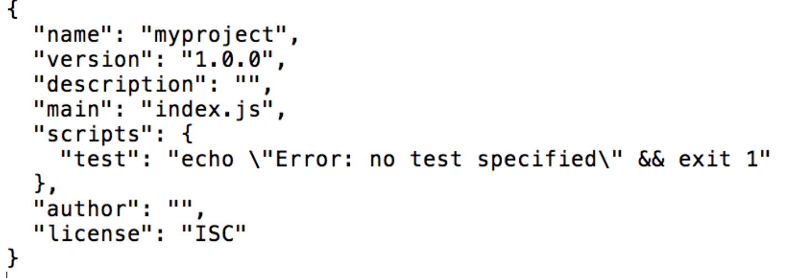
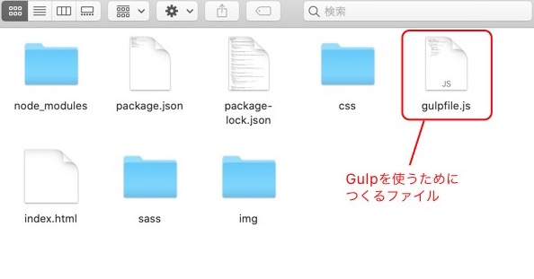
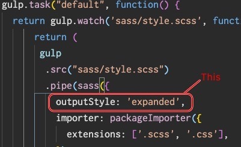

お仕事で gulp を使うようになるので、set up の覚書。

#### 何はともあれインストール

node.js がインストールされているていで進めます。  
これから gulp を導入したい作業ディレクトリを作り、そのディレクトリに移動。

```
 mkdir test-gulp
```

```
cd test-gulp
```

package.jason をディレクトリに作成。

```
npm init -y
```


jason ファイルの中身はこんな感じに。  
これからここに設定などが色々入ってきます。

## Gulp のインストール。

```
 npm install -D gulp
```

これで gulp が使える状態になった様子。

## Sass を gulp でコンパイルする

このためには、モジュールが必要。  
インストールします。

```
npm install -D gulp-sass
```

gulp-sass は、sass をコンパイルするためのプラグイン 。

sass をコンパイルするために、gulpfile.js というファイルをプロジェクト直下につくり、その中に設定を記述していく。



▼gulpfile.js

```js
const gulp = require("gulp"); //本体の読み込み
const sass = require("gulp-sass"); // Sassをコンパイルするプラグインの読み込み

gulp.task("default", function () {
  // タスクを作成する

  return (
    // style.scssファイルを取得
    gulp
      .src("sass/style.scss") //タスクの対象となるファイルを取得
      .pipe(sass()) // Sassのコンパイルを実行
      .pipe(gulp.dest("css")) // cssフォルダー以下にcssを吐き出す
  );
});
```

### 実行

ターミナルに戻って実行！

```
npx gulp
```

これで css ディレクトリに sass からコンパイルされた css ファイルが作成されます。  
※もし`command not found`みたいに出たら、`npm install gulp-cli -g`で gulp コマンドが聞くようになったが、このコマンドは非推奨らしい。

[こちら : gulp-cli はインストールすべきじゃないと、思うよ](https://qiita.com/sawa-zen/items/413bab0ec738a272c0b0)

うーん、あしからず。よい方法あれば追記します or 教えてください。

## sass でリセット css を読み込む

sass を使う前にリセット css を読み込む設定をする。  
[node-sass-package-importer](https://www.npmjs.com/package/node-sass-package-importer) なるものを使うと順調な模様。  
一緒にインストール。

```
$ npm i -D node-sass-package-importer
$ npm i -S html5-reset normalize.css
```

sass のオプションに指定する
▼gulpfile.js

```js
const gulp = require("gulp");
const sass = require("gulp-sass");
const packageImporter = require("node-sass-package-importer"); //node-sass-package-importer

gulp.task("default", function () {
  return gulp
    .src("sass/style.scss")
    .pipe(
      sass({
        //オプションに指定
        importer: packageImporter({
          extensions: [".scss", ".css"],
        }),
      })
    )
    .pipe(gulp.dest("css"));
});
```

### リセット css をインポートする

▼style.scss  
ファイルの top で読み込んで完了！

```
@import "~normalize.css";
@import "~html5-reset";
```

これでリセット css の反映はできているはず。

### コンパイルあとのインデントをきれいにする

コンパイルされて css に吐き出されたコードのインデントが、scss のネストをそのまま引き継いでしまうため、  
これをきれいにします。

```js
gulp.task("default", function () {
  return gulp
    .src("sass/style.scss")
    .pipe(
      sass({
        outputStyle: "expanded", //ここを追加
        importer: packageImporter({
          extensions: [".scss", ".css"],
        }),
      })
    )
    .pipe(gulp.dest("css"));
});
```


これできれいに整形されます。ok!

### コンパイルを自動化する

毎回`npx gulp`と打ってコンパイルしてたらかなりだるいですね。  
自動化します。  
これでリロードすればコンパイルされてます。  
本当はリロードしなくてもコンパイルされてるのが理想なんだけど、方法あるかな‥
